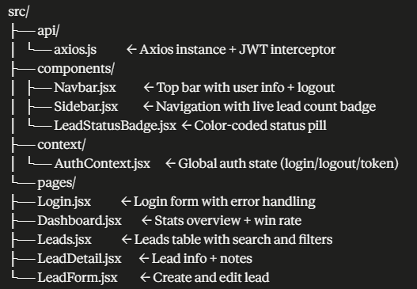

# CRM Rashmi Portal

Frontend for the CRM Lead Management System 

## 📄 Full Project Documentation
[View Complete Project Documentation](https://drive.google.com/file/d/1e80M_J_5s01ooRv9SYLK3NDffAg91bE5/view?usp=drive_link)

## 🔗 Links
- **Live App:** https://crm-rashmi-portal.vercel.app
- **Backend API:** https://crm-rashmi-service.onrender.com
- **Demo Video:** [Watch on Loom](YOUR_LOOM_LINK)

## 🔑 Test Credentials
| Email | Password |
|-------|----------|
| admin@example.com | password123 |
| rashmi@example.com | password123 |

> ⚠️ Note: Backend runs on Render free tier. First login after inactivity may take ~30 seconds to wake up. Please wait and try again.

## 🛠 Tech Stack
- React + Vite
- Tailwind CSS
- Axios
- React Router DOM
- Lucide React (icons)

## ✅ Features
- JWT login with automatic logout on token expiry
- Protected routes — redirects to login if not authenticated
- Dashboard with 7 live stats + win rate calculation
- Leads table with search by name, company, email
- Filter by status, lead source, and assigned salesperson
- Create, edit, delete leads
- Lead detail page with all fields
- Add and delete notes per lead (created_by from JWT token)
- Live lead count badge in sidebar
- Color-coded status badges
- Responsive layout with mobile sidebar drawer

## ⚙️ Setup Instructions

### 1. Clone the repo
```bash
git clone https://github.com/rashdiwsl/crm-rashmi-portal.git
cd crm-rashmi-portal
```

### 2. Install dependencies
```bash
npm install
```

### 3. Start the app
```bash
npm run dev
```

App runs on http://localhost:5173

> Make sure crm-rashmi-service backend is running on port 5000 first.

## 🌍 Environment Variables

| Variable | Description |
|----------|-------------|
| VITE_API_URL | Backend API base URL (default: http://localhost:5000/api) |

No `.env` file needed for local development. For production, set `VITE_API_URL` in your Vercel project settings.

## 📁 Project Structure


## ⚠️ Known Limitations
- Render backend may take ~30 seconds to wake up after inactivity
- No pagination on leads list
- No role-based access control

## 💭 Reflection

Building the frontend taught me how React Context eliminates prop drilling for global state like authentication, how Axios interceptors keep JWT logic centralised and DRY, and how to structure protected routes in React Router. The most interesting challenge was handling the Vercel SPA routing issue — direct URL access and page refreshes returned 404 until I added a `vercel.json` rewrite rule to always serve `index.html` and let React Router handle routing client-side.
